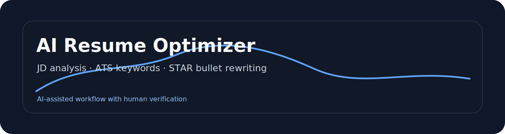
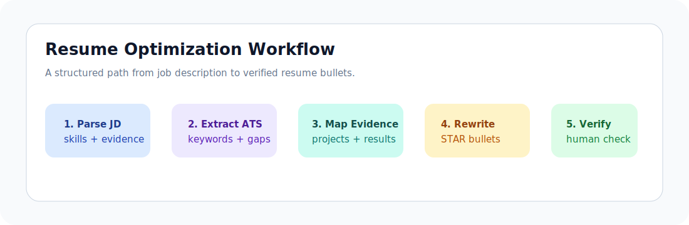

<p align="center">
  
</p>

<p align="center">
  
  
  
</p>

# AI Resume Optimizer

A practical AI-assisted workflow for matching a resume to job descriptions, extracting ATS keywords, and rewriting experience bullets with clearer evidence.

## At a Glance

| Item | Detail |
| --- | --- |
| Role fit | Data analyst internship, AI product internship, AI operations |
| Core value | Turns a job description into a structured resume optimization workflow |
| Main skills | Prompt engineering, keyword extraction, evidence mapping, STAR writing |
| Recruiter signal | Practical AI usage with human judgment and verification |

## Workflow Preview

<p align="center">
  
</p>

## Project Background

During internship applications, I noticed that many resumes fail not because the candidate lacks experience, but because the resume does not reflect the language, priorities, and evidence expected by the role. This project turns that problem into a structured workflow: read the job description, identify the core requirements, map existing experience, and rewrite bullets using a consistent evaluation framework.

## Problem I Solved

I wanted a repeatable process that helps a student candidate:

- Understand what a job description is really asking for.
- Identify missing or weak keywords.
- Rewrite experience using action, method, result, and relevance.
- Avoid exaggerated AI-generated claims.

## Tools & Tech Stack

- ChatGPT / Claude / Gemini for structured analysis and rewriting support.
- Python for text preprocessing and keyword extraction prototype.
- Markdown for prompt templates and documentation.
- Excel / Google Sheets for application tracking.

## Core Features

- JD requirement extraction.
- ATS-style keyword checklist.
- Resume-to-JD matching matrix.
- STAR bullet rewriting prompts.
- Role-specific resume summary generator.
- Human review checklist to keep claims accurate.

## Project Highlights

- Designed the workflow around human verification, not one-click resume generation.
- Built prompt templates for data analyst, AI product, and AI operations roles.
- Separated keyword matching from evidence quality so the output stays realistic.
- Converted vague experience into measurable, role-aligned bullets.

## Data / AI / Product Thinking

- Data thinking: uses keyword frequency, requirement grouping, and fit scoring.
- AI thinking: uses LLMs for structured drafting while keeping final judgment human.
- Product thinking: solves a real user pain point with a simple workflow and reusable templates.

## Outcome

This project provides a practical job-search toolkit that can be reused across different internship roles and adapted as new application requirements appear.

## Repository Structure

```text
ai-resume-optimizer/
├── README.md
├── docs/
│   ├── workflow.md
│   └── evaluation-rubric.md
├── prompts/
│   ├── jd-analysis.md
│   ├── ats-keywords.md
│   └── star-rewrite.md
├── src/
│   └── keyword_extractor.py
├── examples/
│   └── sample-output.md
└── assets/
```

## Resume Bullet

- Built an AI-assisted resume optimization workflow that parses job descriptions, extracts ATS keywords, maps candidate evidence, and rewrites experience bullets for data analytics and AI product internship applications.

## Next Improvements

- Add a Streamlit prototype for uploading a JD and resume text.
- Add a scoring rubric for evidence quality and keyword coverage.
- Add more before/after resume bullet examples.

## Contact

For questions or collaboration: [steventang30999@gmail.com](mailto:steventang30999@gmail.com)
